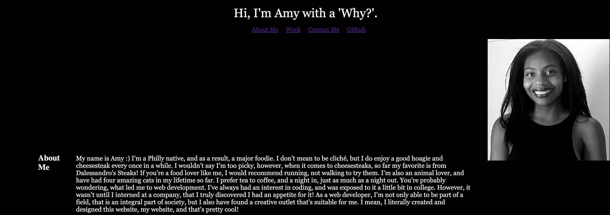
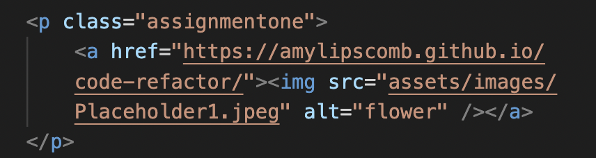
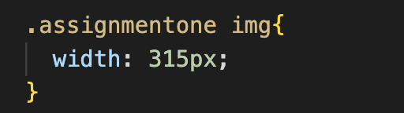

# Portfolio
Welcome! If you don't know me by now, then hopefully by the end of viewing my portfolio, you will! Below is a snippet of what it looks like. Please take a look and enjoy. 

[Deployed Website][https://amylipscomb.github.io/Portfolio/]

<strong>My Task</strong>

As a web developer, an important way to stand out from the crowd is to create a portfolio. A portfolio is  a way to showcase your work, and tell a little bit about yourself. To start, I created my webpage from scratch via VS Code, and then from there, utilized the knowledge I've gained about html, and css. I not only had to write about myself, but I also had to include links to my work, and information about how I can be reached. While working on this assignment, I found my biggest challenge was rearranging the pictures. I used flexbox and dev tools to play around with the images, until I was finally able to find a placement I felt comfortable with. While working on this, I had to create one image that was larger than the others. In order to do this, I utlized a class attribute. Below are screenshots of the actual coding, and how it turned out on the webpage! 

HTML Screenshot

CSS Screenshot

Final Result

While working on my porfolio, I made sure to save my work constantly, utilizing 'git push', and made sure that each time I made commits, each commit had descriptive messages. 

<strong>Technologies Used</strong>	

-	HTML 
-	CSS
-	VS Code

I hope you enjoyed viewing my portfolio, and learning about the process behind the coding!